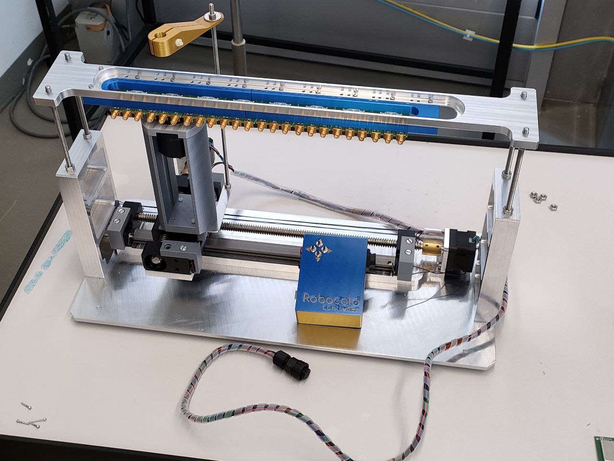

# Robocold

*Robocold* is a two axes automatic "robot" I built to put inside the climate chamber in our lab and move the beta source together with the reference trigger (a PMT) around automatically. The main purpose is the long term tests on LGADs, but it can be used for anything that requires this. In this repo there are the files related to *Robocold*.



# Python interface

There is a simple Python interface so it is trivial to control from any PC connected via USB to the *Robocold controller*. The code can be found [here](code/python).

## Installation

```
pip install -e PATH_TO_DIRECTORY_WHERE_THIS_README_FILE_IS/code/python
```

## Usage

```python
from robocoldpy import Robocold, find_Robocold_port

robocold = Robocold(find_Robocold_port().device)
	
for cmd in {'IDN?','VERSION?'}:
	print(cmd)
	print(robocold.query(cmd))

print('Resetting position, may take a while...')
robocold.reset()

print(robocold.position)
for kL in range(11):
	robocold.move((0,-1111))
	robocold.move((55,0))
	for kS in range(10):
		print('Moving...')
		robocold.move((0,22))
		print(robocold.position)
		time.sleep(.1)

p = (270,200)
print(f'Moving to {p}')
robocold.move_to(p)
print(robocold.position)
```

# Controller firmware

The *Robocold controller* (the 3D printed box with the buttons and connectors in the picture) is based on an Arduino Uno board. The firmware can be found [here](code/arduino).
